# 🚑 Golden Hour — Complete User Manual

> **Golden Hour** is an AI-powered, mission-critical Emergency Medical Response & Healthcare Interoperability platform. Designed around the crucial first 60 minutes after trauma or acute onset ("The Golden Hour"), it connects Citizens/Patients, Ambulance Pilots, Hospital Emergency Rooms, OPD Doctors, and Rural ASHA Sanginis in real time.

---

## 📑 Table of Contents
1. [Installation & Standalone APK Download](#1-installation--standalone-apk-download)
2. [Quick Demo Credentials & Navigation](#2-quick-demo-credentials--navigation)
3. [Role 1: Citizen / Patient Emergency Portal](#3-role-1-citizen--patient-emergency-portal)
   - 3.1 [One-Tap SOS & 3-Second Safety Countdown](#31-one-tap-sos--3-second-safety-countdown)
   - 3.2 [Multimodal Gemini AI Clinical Triage](#32-multimodal-gemini-ai-clinical-triage)
   - 3.3 [Live ER Proximity Matching & Bed Ranks](#33-live-er-proximity-matching--bed-ranks)
   - 3.4 [Doctor Appointments & Live Queue Tracking](#34-doctor-appointments--live-queue-tracking)
   - 3.5 [Patient Electronic Health Records & Citywide Drug Stock](#35-patient-electronic-health-records--citywide-drug-stock)
4. [Role 2: Ambulance Pilot / Driver Console](#4-role-2-ambulance-pilot--driver-console)
   - 4.1 [Duty State Management (On-Duty / Off-Duty)](#41-duty-state-management-on-duty--off-duty)
   - 4.2 [Emergency Dispatch Acceptance](#42-emergency-dispatch-acceptance)
   - 4.3 [On-Site Arrival: "Marked at Patient Location"](#43-on-site-arrival-marked-at-patient-location)
   - 4.4 [False Request / "Patient Not Found" Handling](#44-false-request--patient-not-found-handling)
   - 4.5 [Turn-by-Turn Voice GPS Navigation & Hospital Telemetry](#45-turn-by-turn-voice-gps-navigation--hospital-telemetry)
5. [Role 3: Hospital ER Command Center](#5-role-3-hospital-er-command-center)
   - 5.1 [ER Command Center & Live Capacity Monitoring](#51-er-command-center--live-capacity-monitoring)
   - 5.2 [Live Bed & ICU Capacity Ledger](#52-live-bed--icu-capacity-ledger)
   - 5.3 [Emergency Drug Inventory Management](#53-emergency-drug-inventory-management)
   - 5.4 [Doctor & ASHA Referrals Hub (Unread Bell Badge)](#54-doctor--asha-referrals-hub-unread-bell-badge)
   - 5.5 [Referral Admission & Bed Release on Discharge](#55-referral-admission--bed-release-on-discharge)
6. [Role 4: Doctor OPD Clinic & Teleconsultation](#6-role-4-doctor-opd-clinic--teleconsultation)
   - 6.1 [Digital OPD Queue Management & Token Calling](#61-digital-opd-queue-management--token-calling)
   - 6.2 [Clinical Consultation & Digital Prescriptions (Rx)](#62-clinical-consultation--digital-prescriptions-rx)
   - 6.3 [Emergency Hospital Referral Toggle](#63-emergency-hospital-referral-toggle)
   - 6.4 [Live HD Audio/Video Teleconsultation](#64-live-hd-audiovideo-teleconsultation)
7. [Role 5: ASHA Sangini / Rural Frontline Worker](#7-role-5-asha-sangini--rural-frontline-worker)
   - 7.1 [Rural Community Directory & High-Risk Profiles](#71-rural-community-directory--high-risk-profiles)
   - 7.2 [Point-of-Care Home Visit Vitals Logging](#72-point-of-care-home-visit-vitals-logging)
   - 7.3 [Dual-Language AI Clinical Guidance (Hindi & English)](#73-dual-language-ai-clinical-guidance-hindi--english)
   - 7.4 [Digital Referral to PHC / District Hospital](#74-digital-referral-to-phc--district-hospital)
   - 7.5 [100% Offline-First Synchronization Engine](#75-100-offline-first-synchronization-engine)
8. [Role 6: Medical Administrator & Authority Console](#8-role-6-medical-administrator--authority-console)
9. [Evaluator Troubleshooting & Verification Matrix](#9-evaluator-troubleshooting--verification-matrix)

---

## 1. Installation & Standalone APK Download

The Golden Hour platform is compiled as an optimized, standalone **Android APK package (`.apk`)**. No development software or command-line execution is required for juries or users.

1. **Download:** Tap the provided direct APK download link or scan the distribution QR code.
2. **Install:** Open the downloaded `.apk` file on your Android smartphone. If prompted, enable *"Install unknown apps"* in your device settings.
3. **Launch:** Tap the Golden Hour icon on your home screen.
4. **Permissions:** On initial launch, grant **Location Access ("While using the app")** to enable real-time emergency dispatch and live vehicle telemetry.

---

## 2. Quick Demo Credentials & Navigation

For rapid evaluation and live presentations without entering passwords or receiving SMS OTPs, each login screen includes an instant **1-Tap Quick Demo Button**:

| Role | Screen Route | 1-Tap Demo Button | Pre-loaded Identity |
| :--- | :--- | :--- | :--- |
| **Citizen / Patient** | `/login` | `Explore as Demo Patient` | **Rahul Patel** (`+91 98765 43210`, Blood Group: O+) |
| **Ambulance Pilot** | `/driver-login` | `Quick Demo Pilot` | **Pilot Ramesh Kumar** (Ambulance `UP-70-AMB-108`) |
| **Hospital ER Desk** | `/hospital-login` | `Quick Demo Hospital` | **Apollo Multi-Specialty** / **SRN Trauma Center** |
| **OPD Doctor** | `/doctor-login` | `Quick Demo Doctor` | **Dr. Ananya Sharma** (OPD Clinic, Civil Lines) |
| **ASHA Worker** | `/asha-login` | `Quick Demo ASHA` | **Sunita Verma** (ASHA Sangini, Prayagraj Rural) |
| **Admin Console** | `/admin-dashboard` | Role Select screen | **Chief Medical Officer (CMO Desk)** |

### Role Selection & Trilingual Support

  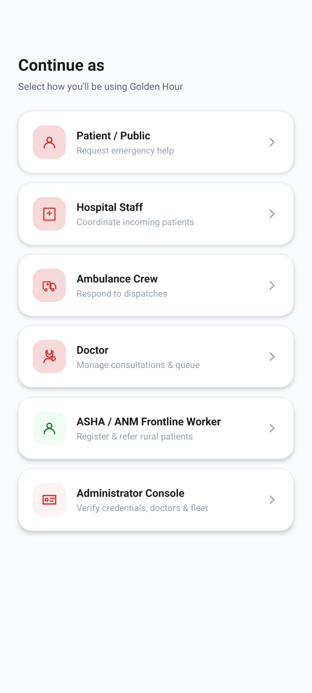
  &nbsp;&nbsp;&nbsp;&nbsp;
  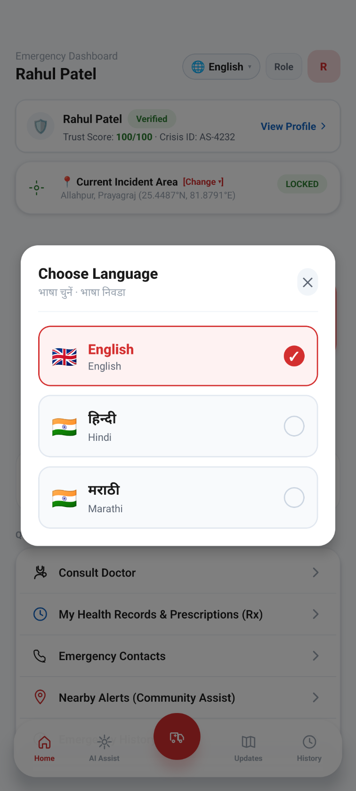

- **Language Selector:** Tap the **Globe icon** at the top-right corner to toggle between **English**, **हिंदी (Hindi)**, and **मराठी (Marathi)**. All clinical instructions, badges, and interface copy translate instantly.
- **1-Tap Role Switching:** Tap the **‹ Back / Switch Role** button at the top-left of any dashboard to log out or jump immediately to another role during evaluation.

---

## 3. Role 1: Citizen / Patient Emergency Portal

  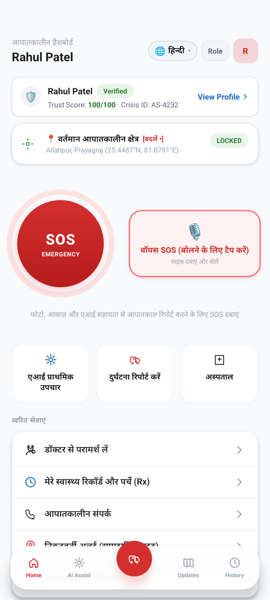

### 3.1 One-Tap SOS & 3-Second Safety Countdown
- Tap the pulsating red **"SOS EMERGENCY"** button on the home screen.
- A 3-second safety countdown initiates with an audible vibration.
- When the countdown finishes, GPS coordinates, medical history, blood group, and emergency contacts are immediately transmitted to the closest active ambulance and trauma hospital.

### 3.2 Multimodal Gemini AI Clinical Triage

  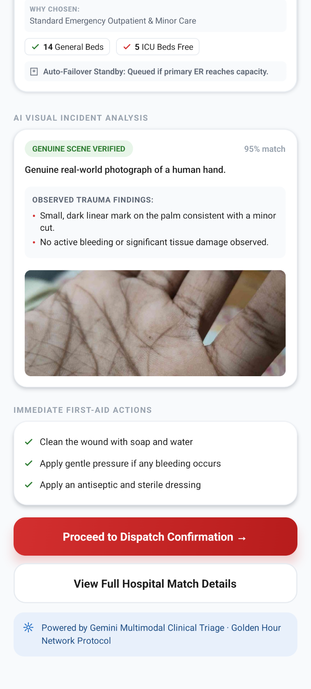
  &nbsp;&nbsp;&nbsp;&nbsp;
  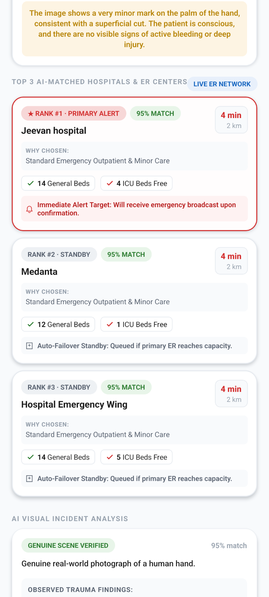

- **Scene Verification:** Evaluates captured trauma photos (wound depth, active bleeding, consciousness).
- **First-Aid Guidance:** Provides immediate stabilization instructions (wound pressure, posture).
- **Hospital Ranking:** Matches the top 3 trauma facilities (e.g., *Jeevan Hospital*, *Medanta*) based on open general beds, ICU beds, and live driving distance.

### 3.3 Doctor Appointments & Live Queue Tracking

  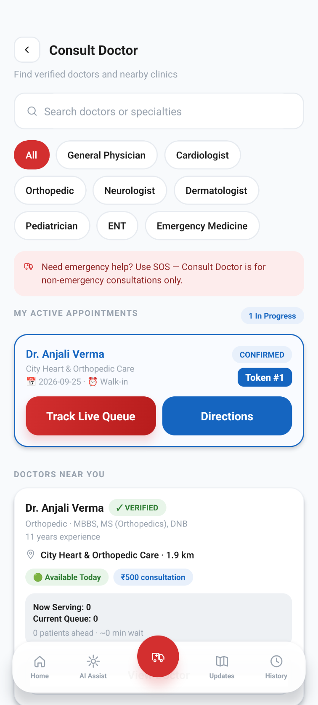
  &nbsp;&nbsp;&nbsp;&nbsp;
  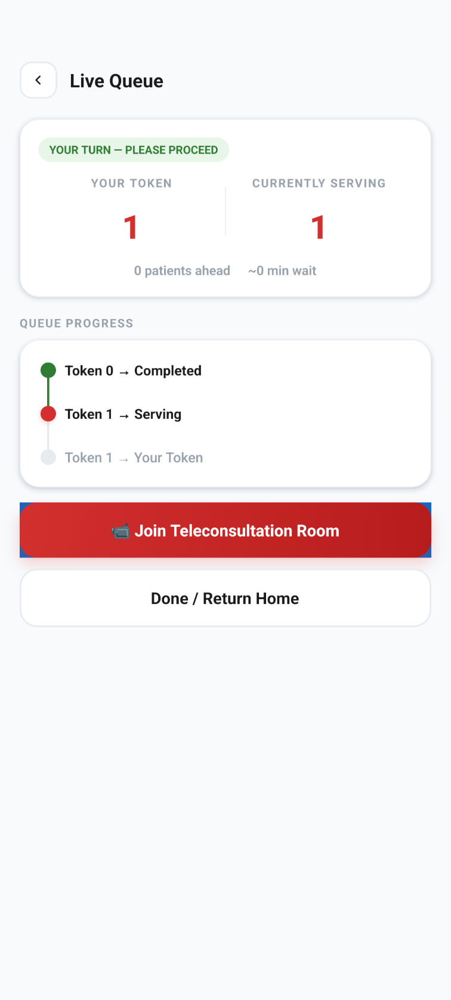

- **Appointment Booking:** Search by medical specialty (*Cardiologist*, *Orthopedic*, *Neurologist*).
- **Live Queue Tracking:** Patients track their live queue progress (e.g., *Token #1 — Currently Serving*) from home and tap **"Join Teleconsultation Room"** for remote calls.

### 3.4 Patient Electronic Health Records & Citywide Drug Stock

  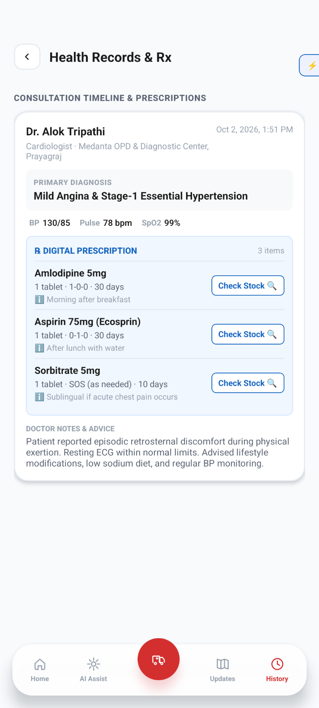
  &nbsp;&nbsp;&nbsp;&nbsp;
  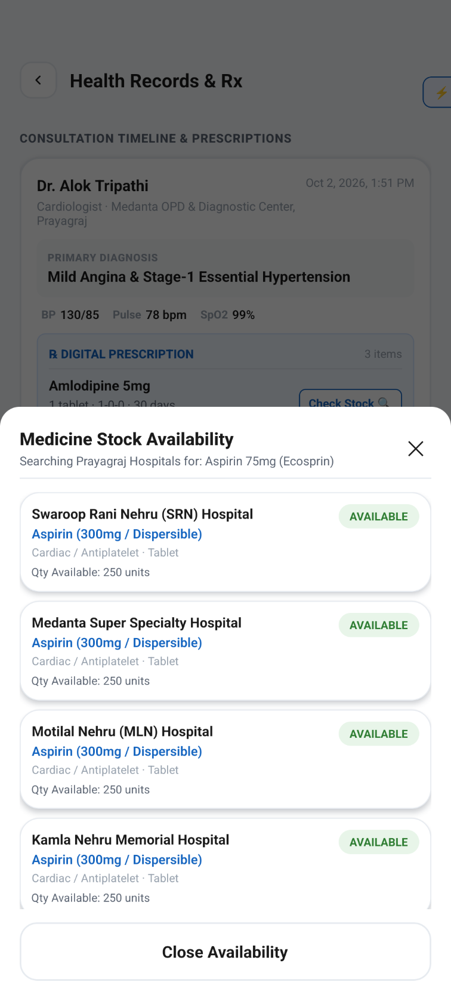

- **Digital Prescriptions (Rx):** View past clinical encounters, doctor notes, and prescribed medicines (Amlodipine, Aspirin, Sorbitrate).
- **Live Citywide Stock Search:** Tap **"Check Stock"** on any medicine to view real-time availability across Prayagraj hospitals (*SRN Hospital: 250 units*, *Medanta: 250 units*, *MLN Hospital: Available*).

---

## 4. Role 2: Ambulance Pilot / Driver Console

  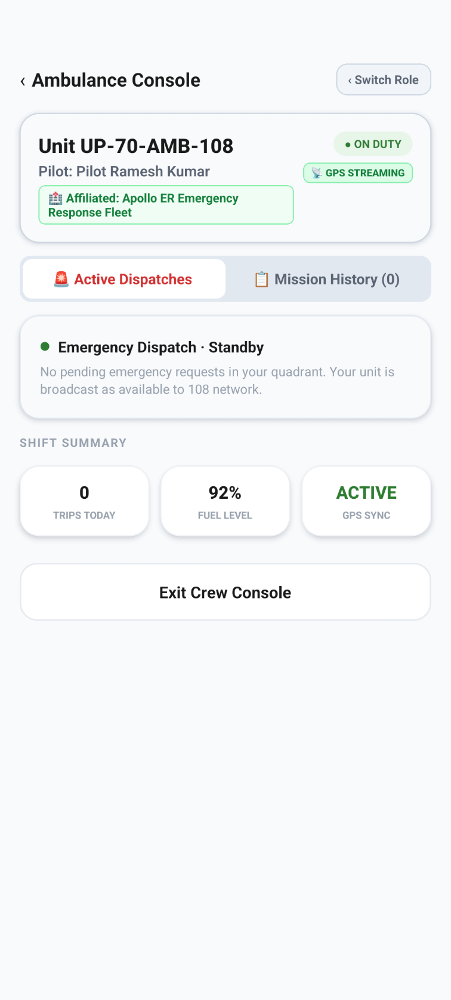

### 4.1 Duty State Management (On-Duty / Off-Duty)
1. Open **Driver Login** ➔ Tap **"Quick Demo Pilot"**.
2. Toggle the switch at the top to **"ON DUTY"**. The green badge confirms discoverability by the dispatch engine.

### 4.2 Emergency Dispatch Acceptance
- When an emergency occurs in your vicinity:
  - An audible alert sounds with a dispatch card displaying: Patient Name, Severity, Distance, and ETA.
  - Tap **"Accept Emergency"**.

### 4.3 On-Site Arrival: "Marked at Patient Location"
- When arriving at the patient's coordinates, tap **"Marked at Patient Location"**.
- This updates both the patient and the hospital ER desk that paramedics are on-scene.

### 4.4 False Request / "Patient Not Found" Handling
- If the patient is missing or the call was fraudulent:
  - Tap **"Patient Not Found / False Request"**.
  - The mission terminates with status `FALSE_ALARM` without penalizing the driver, returning the ambulance to active standby.

### 4.5 Turn-by-Turn Voice GPS Navigation & Hospital Telemetry

  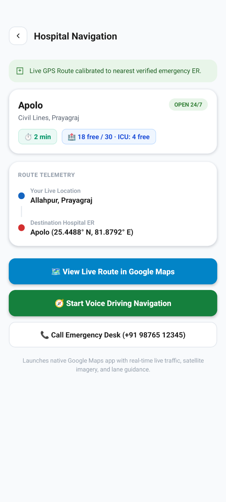

- Calibrates dynamic driving route to the nearest verified emergency hospital (*Apollo Hospital ER*).
- Displays live hospital metrics en route: **18 free beds, 4 ICU beds**.
- 1-Tap buttons to launch native **Google Maps Turn-by-Turn Voice Navigation** or **Direct Call to Emergency Desk**.

---

## 5. Role 3: Hospital ER Command Center

  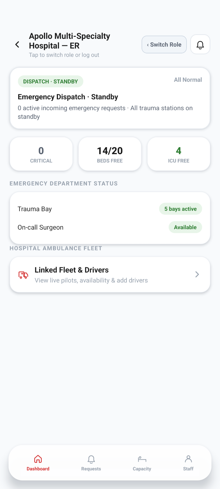

### 5.1 ER Command Center & Live Capacity Monitoring
- Real-time command dashboard displays active emergency requests, free general beds, and free ICU beds.
- Tracks trauma bay readiness and on-call surgeons.

### 5.2 Live Bed & ICU Capacity Ledger

  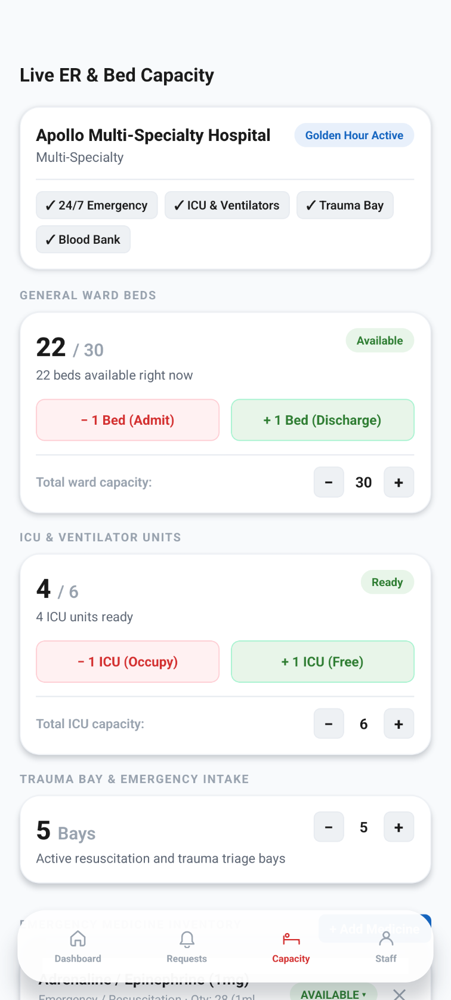
  &nbsp;&nbsp;&nbsp;&nbsp;
  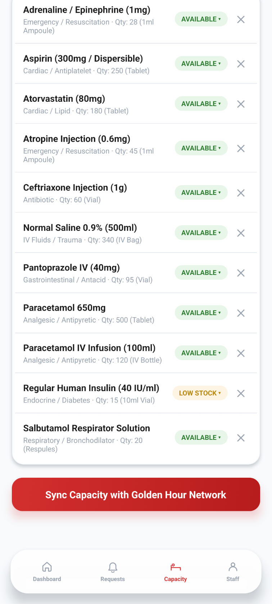

- **General Beds (22/30):** 1-Tap `- 1 Bed (Admit)` and `+ 1 Bed (Discharge)` buttons.
- **ICU Units (4/6):** 1-Tap `- 1 ICU (Occupy)` and `+ 1 ICU (Free)` buttons.
- **Emergency Drug Inventory:** Tracks critical resuscitation supplies (Adrenaline, Aspirin, Atropine, Insulin, Normal Saline).
- **Network Sync:** Tap **"Sync Capacity with Golden Hour Network"** to broadcast updates across city ambulances.

### 5.3 Doctor & ASHA Referrals Hub (Unread Bell Badge)
- Top Navigation: **[Emergencies]** vs **[Doctor / Community Referrals]**.
- **Unread Notification Bell:** Displays a red **"1"** badge when a new referral arrives. Tapping the bell opens the list and resets the badge to 0.
- **Referral Lifecycle:**
  1. **Accept:** Tap **"Accept & Reserve Bed"** (Reserves 1 bed).
  2. **Admit:** When the patient arrives, tap **"Patient Arrived / Admit"** (Status: `ADMITTED`).
  3. **Discharge:** When treatment concludes, tap **"Discharge & Free Bed"** (Releases the held bed back into available inventory).

---

## 6. Role 4: Doctor OPD Clinic & Teleconsultation

  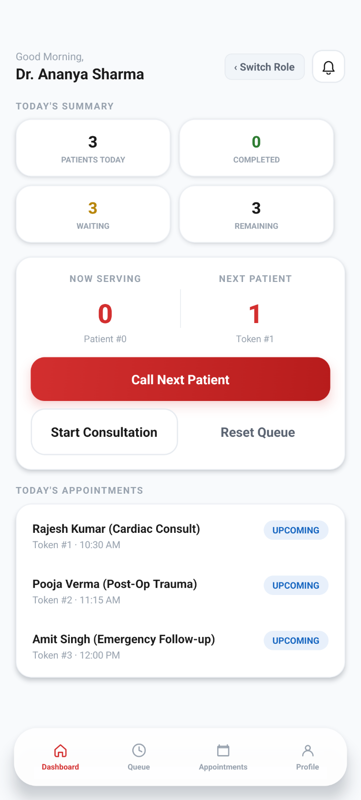
  &nbsp;&nbsp;&nbsp;&nbsp;
  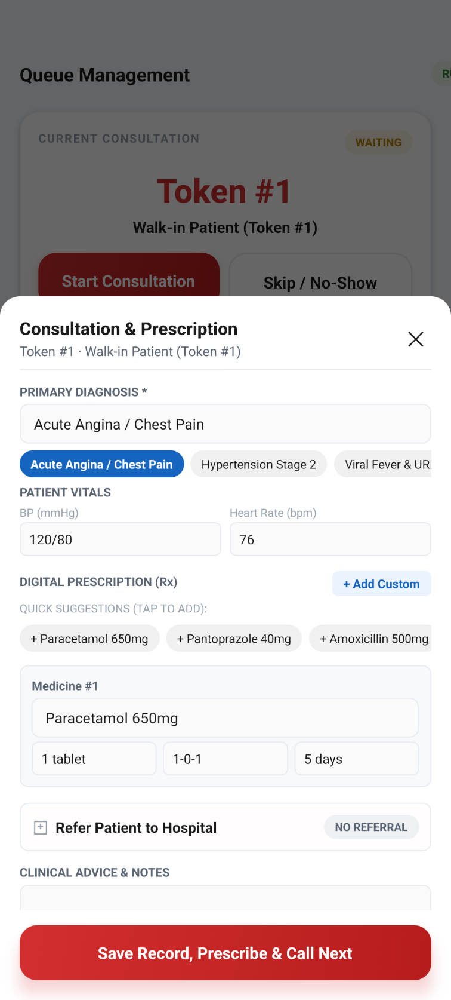

### 6.1 Digital OPD Queue Management & Token Calling
1. Open **Doctor Login** ➔ Tap **"Quick Demo Doctor"**.
2. View today's summary (3 Patients, 3 Waiting).
3. Tap **"Call Next Patient"** to advance Token #1, Token #2, etc.

### 6.2 Clinical Consultation & Digital Prescriptions (Rx)
- Select primary diagnosis (e.g., *Acute Angina*, *Hypertension Stage 2*, *Viral Fever*).
- Record patient vitals (BP `120/80`, Heart Rate `76 bpm`).
- Add standard digital medications (Paracetamol 650mg, Pantoprazole 40mg, Amoxicillin 500mg).

### 6.3 Emergency Hospital Referral Toggle
- If the patient requires emergency hospitalization:
  1. Toggle **"Refer Patient to Hospital"** to ON.
  2. Select destination hospital (e.g., *Swaroop Rani Nehru Hospital* or *Apollo Multi-Specialty*).
  3. Select Priority: **HIGH** or **NORMAL**.
  4. Tap **"Save Record, Prescribe & Call Next"**.
  - The digital referral transmits instantly to the hospital ER console.

---

## 7. Role 5: ASHA Sangini / Rural Frontline Worker

  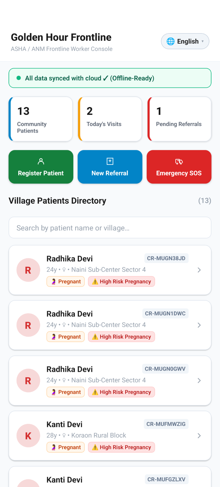
  &nbsp;&nbsp;&nbsp;&nbsp;
  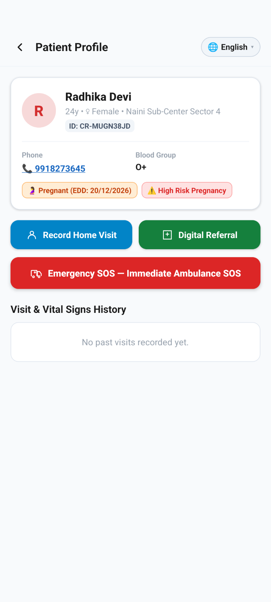

### 7.1 Rural Community Directory & High-Risk Profiles
- Open **ASHA Login** ➔ Tap **"Quick Demo ASHA"**.
- View high-risk rural profiles: pregnant women (e.g., *Radhika Devi, 24y, O+, High Risk Pregnancy, EDD: 20/12/2026*).
- 1-Tap **"Emergency SOS — Immediate Ambulance SOS"** dispatches an ambulance to the village.

### 7.2 Digital Referral to PHC / District Hospital

  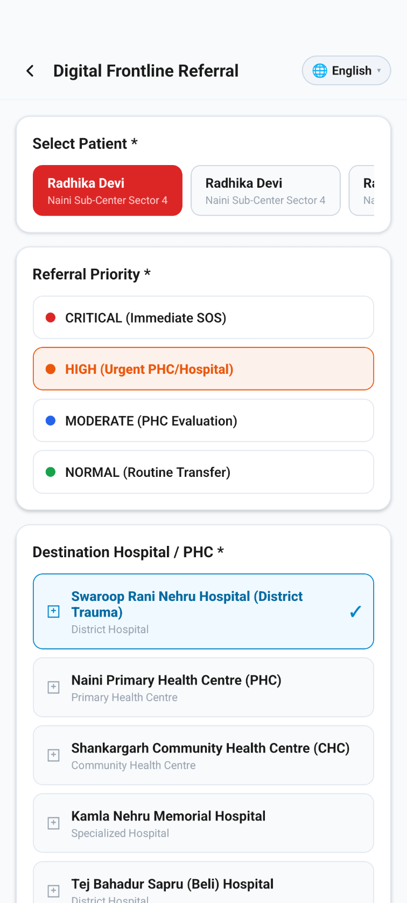

1. Tap **"Digital Referral"**.
2. Select Priority: **CRITICAL (Immediate SOS)**, **HIGH (Urgent PHC/Hospital)**, **MODERATE**, or **NORMAL**.
3. Select Destination Hospital / PHC:
   - *Swaroop Rani Nehru Hospital (District Trauma)*
   - *Naini Primary Health Centre (PHC)*
   - *Shankargarh Community Health Centre (CHC)*
   - *Kamla Nehru Memorial Hospital*
4. Tap **"Submit Digital Referral"**.
   - Generates a unique referral code (`REF-ASHA-XXXX`) that routes directly to the hospital's referrals desk.

### 7.3 100% Offline-First Synchronization Engine
- Operates in rural sub-centers with zero cellular coverage.
- All home visits, vitals, and referrals persist in local encrypted storage.
- Background sync triggers automatically the moment network returns.

---

## 8. Role 6: Medical Administrator & Authority Console

  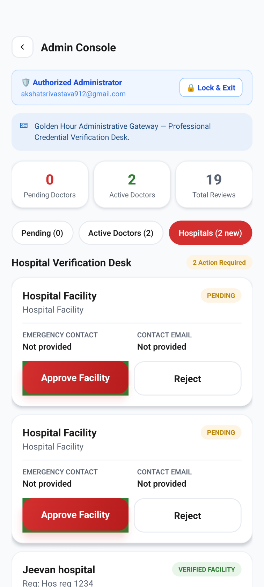

- Authorized Administrator verification portal (`akshatsrivastava912@gmail.com`).
- **Hospital Verification Desk:** Review and approve/reject newly registered hospitals, verify licenses, and activate emergency ER consoles.
- **Provider Auditing:** Track active doctors, pending applications, and citywide emergency response metrics.

---

## 9. Evaluator Troubleshooting & Verification Matrix

| Test Scenario | Root Cause | Solution |
| :--- | :--- | :--- |
| **Referral not visible on hospital desk** | Viewing wrong tab or cached state | Switch to the **"Doctor / Community Referrals"** tab and pull down from top to refresh. |
| **Bell icon badge stuck at 1** | Referrals screen not opened yet | Tap directly on the **Bell Icon** in the header; it immediately opens the referrals queue and clears the badge to 0. |
| **Location permission alert appears** | Device GPS was disabled | Grant *"Precise Location While In Use"* in device settings. |
| **Rapid role switching during evaluation** | Testing all roles on a single device | Tap the **‹ Back / Switch Role** button at the top-left of any dashboard to instantly change roles without re-logging in. |
| **Testing without cellular network** | Simulating remote village | Use ASHA or Driver mode freely; all records save locally and automatically sync when Wi-Fi/data returns. |

---

### 🌟 Project Mission
**Golden Hour** bridges the critical divide between distress calls and hospital doors. Through coordinated AI triage, live hospital bed synchronization, driver false-alarm protection, and rural ASHA connectivity, the platform ensures that no life is lost due to delays during the golden hour.
