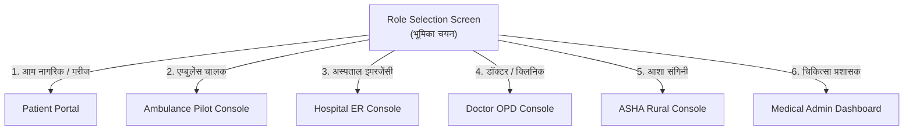

# 🚑 Golden Hour (Project 911) — संपूर्ण यूजर मैनुअल (Complete User Manual)

> **गोल्डन ऑवर (Golden Hour)** एक जीवन-रक्षक इमरजेंसी मेडिकल रिस्पॉन्स और हेल्थकेयर कोऑर्डिनेशन प्लेटफॉर्म है। यह आपातकाल के पहले 60 मिनट ("गोल्डन ऑवर") में मरीज, एम्बुलेंस पायलट, अस्पताल, डॉक्टर और आशा कार्यकर्ता के बीच रियल-टाइम तालमेल स्थापित करता है।

---

## 📑 विषय-सूची (Table of Contents)
1. [ऐप शुरू करना और भूमिका चयन (Getting Started & Role Selection)](#1-ऐप-शुरू-करना-और-भूमिका-चयन)
2. [भाषा चयन और अकाउंट स्विचिंग (Language & Account Switching)](#2-भाषा-चयन-और-अकाउंट-स्विचिंग)
3. [भूमिका 1: नागरिक / मरीज (Patient / Citizen Portal)](#3-भूमिका-1-नागरिक--मरीज-patient--citizen-portal)
   - 3.1 [One-Tap SOS & वॉइस SOS (Voice Dispatch)](#31-one-tap-sos--वॉइस-sos)
   - 3.2 [गलत अलार्म / फॉल्स रिक्वेस्ट कैंसिलेशन (False Alarm Protection)](#32-गलत-अलार्म--फॉल्स-रिक्वेस्ट-कैंसिलेशन)
   - 3.3 [लाइव एम्बुलेंस ट्रैकिंग (Live Map & Real-time ETA)](#33-लाइव-एम्बुलेंस-ट्रैकिंग)
   - 3.4 [डॉक्टर अपॉइंटमेंट और ड्रॉपडाउन हिस्ट्री](#34-डॉक्टर-अपॉइंटमेंट-और-ड्रॉपडाउन-हिस्ट्री)
   - 3.5 [डिजिटल मेडिकल प्रोफाइल और इमरजेंसी कॉन्टैक्ट्स](#35-डिजिटल-मेडिकल-प्रोफाइल-और-इमरजेंसी-कॉन्टैक्ट्स)
4. [भूमिका 2: एम्बुलेंस पायलट / ड्राइवर (Ambulance Pilot Console)](#4-भूमिका-2-एम्बुलेंस-पायलट--ड्राइवर-ambulance-pilot-console)
   - 4.1 [लॉग-इन व ड्यूटी स्टेटस (On-Duty / Off-Duty)](#41-लॉग-इन-व-ड्यूटी-स्टेटस)
   - 4.2 [इमरजेंसी रिक्वेस्ट स्वीकारना (Accept Emergency)](#42-इमरजेंसी-रिक्वेस्ट-स्वीकारना)
   - 4.3 [मरीज के स्थान पर पहुंचना ("Marked at Patient Location")](#43-मरीज-के-स्थान-पर-पहुंचना)
   - 4.4 [फॉल्स अलार्म हैंडलिंग ("Patient Not Found")](#44-फॉल्स-अलार्म-हैंडलिंग)
   - 4.5 [मरीज ऑनबोर्ड और अस्पताल हैंडओवर (Hospital Handover)](#45-मरीज-ऑनबोर्ड-और-अस्पताल-हैंडओवर)
5. [भूमिका 3: इमरजेंसी अस्पताल कंसोल (Hospital ER Command Center)](#5-भूमिका-3-इमरजेंसी-अस्पताल-कंसोल-hospital-er-command-center)
   - 5.1 [लॉग-इन और आपातकालीन डैशबोर्ड](#51-लॉग-इन-और-आपातकालीन-डैशबोर्ड)
   - 5.2 [लाइव बेड और ICU क्षमता प्रबंधन (Capacity Management)](#52-लाइव-बेड-और-icu-क्षमता-प्रबंधन)
   - 5.3 [इनकमिंग एम्बुलेंस अलर्ट और बेड रिज़र्वेशन](#53-इनकमिंग-एम्बुलेंस-अलर्ट-और-बेड-रिज़र्वेशन)
   - 5.4 [डॉक्टर और आशा रेफरल टैब (Referrals & Notification Bell)](#54-डॉक्टर-और-आशा-रेफरल-टैब)
   - 5.5 [एडमिशन और मरीज डिस्चार्ज फ्लो (Admit ➔ Discharge)](#55-एडमिशन-और-मरीज-डिस्चार्ज-फ्लो)
6. [भूमिका 4: डॉक्टर / क्लिनिक ओपीडी (Doctor OPD & Teleconsultation)](#6-भूमिका-4-डॉक्टर--क्लिनिक-ओपीडी-doctor-opd--teleconsultation)
   - 6.1 [ओपीडी कतार और टोकन कॉलिंग (Queue & Serving Tokens)](#61-ओपीडी-कतार-और-टोकन-कॉलिंग)
   - 6.2 [पर्चे (Prescription) और हेल्थ रिकॉर्ड तैयार करना](#62-पर्चे-prescription-और-हेल्थ-रिकॉर्ड-तैयार-करना)
   - 6.3 [मरीज को अस्पताल रेफर करना (Hospital Referral)](#63-मरीज-को-अस्पताल-रेफर-करना)
   - 6.4 [टेलीकंसल्टेशन (Live Video Consultation)](#64-टेलीकंसल्टेशन-live-video-consultation)
7. [भूमिका 5: आशा संगिनी / ग्रामीण स्वास्थ्य कार्यकर्ता (ASHA Worker Console)](#7-भूमिका-5-आशा-संगिनी--ग्रामीण-स्वास्थ्य-कार्यकर्ता-asha-worker-console)
   - 7.1 [ग्रामीण मरीज रजिस्ट्री और सर्च](#71-ग्रामीण-मरीज-रजिस्ट्री-और-सर्च)
   - 7.2 [गृह भ्रमण (Home Visit) और वाइटल्स रिकॉर्डिंग](#72-गृह-भ्रमण-home-visit-और-वाइटल्स-रिकॉर्डिंग)
   - 7.3 [हिंदी AI ट्राइएज और मार्गदर्शन (AI Guidance)](#73-हिंदी-ai-ट्राइएज-और-मार्गदर्शन)
   - 7.4 [डिजिटल PHC / जिला अस्पताल रेफरल](#74-डिजिटल-phc--जिला-अस्पताल-रेफरल)
   - 7.5 [ऑफ़लाइन सिंकिंग (Offline-First Storage)](#75-ऑफ़लाइन-सिंकिंग)
8. [भूमिका 6: एडमिनिस्ट्रेटर कंसोल (Admin & Medical Authority)](#8-भूमिका-6-एडमिनिस्ट्रेटर-कंसोल-admin--medical-authority)
9. [समस्या निवारण (Troubleshooting & Quick Tips)](#9-समस्या-निवारण-troubleshooting--quick-tips)

---

## 1. ऐप शुरू करना और भूमिका चयन

### 📱 ऐप खोलने का तरीका
1. अपने मोबाइल फोन या एमुलेटर पर **Golden Hour** ऐप खोलें।
2. यदि आप डेवलपर मोड में हैं, तो टर्मिनल में चलाएं:
   ```bash
   npx expo start -c
   ```
   और Expo Go ऐप या Android Build (APK) से खोलें।
3. ऐप शुरू होने पर **Role Selection (भूमिका चयन)** स्क्रीन दिखाई देती है।



> [!TIP]
> **क्विक डेमो मोड (One-Tap Demo Login):** परीक्षण या प्रेजेंटेशन के दौरान किसी भी भूमिका के लॉगिन पेज पर नीचे दिए गए **"Quick Demo" / "Explore as Demo"** बटन को दबाकर बिना पासवर्ड या OTP के 1 सेकंड में लॉगिन किया जा सकता है।

---

## 2. भाषा चयन और अकाउंट स्विचिंग

- **भाषा बदलना (Language Selector):**
  - हर स्क्रीन के शीर्ष दाएँ कोने (Top-Right) पर ग्लोब/भाषा आइकन मौजूद है।
  - इस पर टैप करके आप तुरंत **English**, **हिंदी (Hindi)** या **मराठी (Marathi)** चुन सकते हैं। पूरा इंटरफ़ेस तुरंत चुनी गई भाषा में बदल जाता है।
- **भूमिका बदलना / लॉगआउट (Role Switching):**
  - हर डैशबोर्ड के शीर्ष बाएँ कोने (Top-Left) पर प्रोफाइल नाम या **‹ Back / Switch Role** बटन है।
  - उस पर टैप करने पर रोल बदलने या लॉगआउट करने का विकल्प मिलता है, जिससे आप तुरंत दूसरी भूमिका में जा सकते हैं।

---

## 3. भूमिका 1: नागरिक / मरीज (Patient / Citizen Portal)

### 3.1 One-Tap SOS & वॉइस SOS
- **इमरजेंसी SOS बटन:**
  - होम स्क्रीन के बीच में बड़ा लाल **"SOS"** बटन है।
  - इसे दबाते ही 3 सेकंड का सेफ्टी काउंटडाउन शुरू होता है, और तुरंत नजदीकी एम्बुलेंस एवं अस्पताल को जीपीएस लोकेशन और मेडिकल प्रोफाइल प्रेषित हो जाती है।
- **वॉइस SOS (Voice AI Emergency):**
  - माइक बटन पर टैप करें या आपातकालीन वाक्य टाइप करें (जैसे *"छाती में तेज दर्द हो रहा है"*, *"सड़क पर एक्सीडेंट हुआ है"* आदि)।
  - **सुरक्षित सत्यापन:** सिस्टम सामान्य प्रश्नों (जैसे *"दवा का नाम क्या है"*) पर तुरंत एम्बुलेंस नहीं भेजता; केवल वास्तविक आपातकालीन स्थिति (Chest Pain, Accident, Breathing Issue) पहचानने पर ही एम्बुलेंस डिस्पैच की पुष्टि करता है।

### 3.2 गलत अलार्म / फॉल्स रिक्वेस्ट कैंसिलेशन
- यदि गलती से SOS दब जाए, तो काउंटडाउन के दौरान या डिस्पैच के बाद **"Cancel Emergency (गलत अलार्म रद्द करें)"** बटन दबाकर कारण चुनकर तुरंत रिक्वेस्ट कैंसिल की जा सकती है।

### 3.3 लाइव एम्बुलेंस ट्रैकिंग
- एम्बुलेंस असाइन होते ही मरीज की स्क्रीन पर:
  - एम्बुलेंस नंबर, ड्राइवर का नाम व संपर्क नंबर।
  - मैप पर एम्बुलेंस की वास्तविक लाइव लोकेशन।
  - सटीक समय (ETA - e.g. "6 min away")।
  - अस्पताल का नाम और रूट डिस्प्ले होता है।

### 3.4 डॉक्टर अपॉइंटमेंट और ड्रॉपडाउन हिस्ट्री
- मरीज अपने पिछले व आगामी अपॉइंटमेंट्स को व्यवस्थित देख सकता है।
- स्क्रीन पर **"Past Appointments"** का ड्रॉपडाउन/अकॉर्डियन उपलब्ध है, जिससे एक साथ सभी पुराने अपॉइंटमेंट्स स्क्रीन पर अव्यवस्था नहीं फैलाते। टैप करने पर पूरा विवरण (तारीख, डॉक्टर, प्रिस्क्रिप्शन) खुलता है।

### 3.5 डिजिटल मेडिकल प्रोफाइल और इमरजेंसी कॉन्टैक्ट्स
- **Medical Setup:** ब्लड ग्रुप, पुरानी बीमारियां (डायबिटीज, हाइपरटेंशन), एलर्जी और नियमित दवाएं दर्ज करें। यह डेटा आपातकाल में अस्पताल के डॉक्टरों को तुरंत दिखता है।
- **Emergency Contacts:** परिजनों के फोन नंबर जोड़ें; SOS दबते ही उन्हें ऑटोमैटिक SMS/अलर्ट भेजा जाता है।

---

## 4. भूमिका 2: एम्बुलेंस पायलट / ड्राइवर (Ambulance Pilot Console)

```mermaid
sequenceDiagram
    autonumber
    actor Patient as मरीज (Patient)
    actor Driver as एम्बुलेंस पायलट (Pilot)
    actor Hospital as अस्पताल (Hospital ER)

    Patient->>Driver: SOS भेजा (GPS & मेडिकल अलर्ट)
    Driver->>Driver: "Accept Emergency" (स्वीकार किया)
    Driver->>Patient: "Marked at Patient Location" (पहुंच गया)
    alt मरीज मिल गया (Patient Found)
        Driver->>Hospital: "Patient Onboard & En Route" (मरीज बैठाया)
        Driver->>Hospital: "Arrived at Hospital & Handover" (सुपुर्द किया)
        Hospital->>Hospital: बेड रिजर्व ➔ मरीज भर्ती (Admitted)
    else मरीज नहीं मिला / फॉल्स रिक्वेस्ट (False Request)
        Driver->>Driver: "Patient Not Found / False Request"
        Driver->>Patient: ट्रिप कैंसिल्ड (डैशबोर्ड रीसेट)
    end
```



### 4.1 लॉग-इन व ड्यूटी स्टेटस
1. **Driver Login** खोलें या **"Quick Demo Pilot"** दबाएं।
2. स्क्रीन के शीर्ष पर टॉगल बटन से **"ON DUTY (ड्यूटी पर)"** सेट करें ताकि नई इमरजेंसी कॉल मिल सकें।

### 4.2 इमरजेंसी रिक्वेस्ट स्वीकारना
- आपातकालीन कॉल आने पर स्क्रीन पर अलार्म के साथ कार्ड आता है:
  - मरीज का नाम, आयु व फोन नंबर।
  - घटना का प्रकार (Trauma / Cardiac / General)।
  - मरीज की जीपीएस दूरी व पता।
- **"Accept Emergency"** पर टैप करें।

### 4.3 मरीज के स्थान पर पहुंचना ("Marked at Patient Location")
- मरीज की दिशा में नेविगेट करने के बाद जब पायलट घटनास्थल पर पहुंचे, तो **"Marked at Patient Location"** बटन दबाएं।

### 4.4 फॉल्स अलार्म हैंडलिंग ("Patient Not Found")
- यदि मौके पर पहुंचने के बाद मरीज वहां न हो या कॉल फेक/गलत पाई जाए:
  - पायलट की स्क्रीन पर स्पष्ट विकल्प आता है: **"Patient Not Found / False Request"**।
  - इस पर टैप करने पर पायलट से कारण पूछा जाता है और कॉल को सुरक्षित रूप से *'FALSE_ALARM'* मार्क कर दिया जाता है, जिससे पायलट बिना किसी पेनल्टी के वापस ड्यूटी के लिए फ्री हो जाता है।

### 4.5 मरीज ऑनबोर्ड और अस्पताल हैंडओवर
1. जब मरीज सुरक्षित एम्बुलेंस में बैठ जाए, तो **"Patient Onboard ➔ En Route to Hospital"** दबाएं।
2. अस्पताल के इमरजेंसी गेट पर पहुंचकर **"Complete Handover & Trip"** दबाएं।
3. मरीज का केस सीधे अस्पताल के ER डॉक्टरों को हैंडओवर हो जाता है।

---

## 5. भूमिका 3: इमरजेंसी अस्पताल कंसोल (Hospital ER Command Center)

### 5.1 लॉग-इन और आपातकालीन डैशबोर्ड
- **Hospital Login** खोलें या **"Apollo Multi-Specialty Hospital" / "SRN Trauma Center"** डेमो बटन दबाएं।
- डैशबोर्ड पर लाइव आंकड़े दिखते हैं: सक्रिय इमरजेंसी, कुल बेड, उपलब्ध ICU बेड, और इनकमिंग एम्बुलेंस।

### 5.2 लाइव बेड और ICU क्षमता प्रबंधन (Capacity Management)
- **Capacity** टैब में जाकर अस्पताल अपनी वर्तमान स्थिति को 1 क्लिक में अपडेट कर सकता है:
  - Regular Beds (सामान्य बेड)
  - ICU Beds (आईसीयू बेड)
  - Oxygen Supported Beds
- यह डेटा शहर के सभी एम्बुलेंस ड्राइवर्स और रेफर करने वाले डॉक्टरों को लाइव दिखता है।

### 5.3 इनकमिंग एम्बुलेंस अलर्ट और बेड रिज़र्वेशन
- जब भी कोई एम्बुलेंस मरीज को लेकर इस अस्पताल की ओर रवाना होती है:
  - अस्पताल कंसोल पर ऑडियो बीप के साथ अलर्ट आता है।
  - मरीज के वाइटल्स (BP, SpO2, Pulse) एम्बुलेंस से लाइव स्ट्रीम होते हैं।
  - अस्पताल 1 टैप से **"Reserve ER Bed"** कर सकता है ताकि मरीज के पहुंचते ही स्ट्रेचर व टीम तैयार मिले।

### 5.4 डॉक्टर और आशा रेफरल टैब
- **Requests & Referrals स्क्रीन:**
  - ऊपर 2 टैब्स हैं: **[Emergencies]** और **[Doctor / Community Referrals]**।
  - जब भी कोई डॉक्टर या आशा कार्यकर्ता मरीज को रेफर करती है, तो:
    - शीर्ष पर घंटी (Bell Icon) पर लाल **"1"** बैज आ जाता है।
    - घंटी दबाते ही रेफरल खुल जाता है और बैज स्वतः क्लियर हो जाता है।
    - रेफरल कार्ड में मरीज का नाम, रेफर करने वाले डॉक्टर/आशा का नाम, क्लिनिक/गांव, मरीज के वाइटल्स और रेफरल कारण स्पष्ट दिखता है।

### 5.5 एडमिशन और मरीज डिस्चार्ज फ्लो
```
[PENDING Referral] 
       │ 
       ▼ (अस्पताल टैप करता है "Accept & Reserve Bed")
[ACCEPTED / Bed Reserved] 
       │ 
       ▼ (मरीज अस्पताल पहुंचा - टैप करता है "Patient Arrived / Admit")
[ADMITTED / In Treatment] 
       │ 
       ▼ (उपचार पूर्ण होने पर - टैप करता है "Discharge & Free Bed")
[DISCHARGED / 1 Bed Freed]
```
- **डिस्चार्ज सत्यापन:** डिस्चार्ज बटन दबाते ही पुष्टि का डायलॉग आता है, मरीज डिस्चार्ज मार्क होता है और अस्पताल का 1 रिजर्व बेड तुरंत वापस फ्री हो जाता है।

---

## 6. भूमिका 4: डॉक्टर / क्लिनिक ओपीडी (Doctor OPD & Teleconsultation)

### 6.1 ओपीडी कतार और टोकन कॉलिंग
1. **Doctor Login** खोलें या **"Dr. Priya Sharma (Demo Clinic)"** चुनें।
2. **Queue (कतार)** स्क्रीन पर आज के सभी मरीजों के टोकन नंबर दिखते हैं।
3. **"Call Next Patient"** दबाकर अगले टोकन को सर्व करें।

### 6.2 पर्चे (Prescription) और हेल्थ रिकॉर्ड तैयार करना
- मरीज की जांच के बाद कंसल्टेशन मॉडल में:
  - **Diagnosis:** बीमारी चुनें या दर्ज करें (जैसे *'Acute Angina'*, *'Typhoid'* आदि)।
  - **Vitals:** बीपी, पल्स, ऑक्सीजन दर्ज करें।
  - **Prescriptions:** दवाइयों की सूची से दवा, खुराक (1-0-1) और दिन चुनें।

### 6.3 मरीज को अस्पताल रेफर करना (Hospital Referral)
- यदि मरीज की हालत गंभीर हो और उसे अस्पताल में भर्ती कराने की जरूरत हो:
  1. फॉर्म में **"Refer Patient to Hospital"** स्विच ऑन करें।
  2. ड्रॉपडाउन से नजदीकी अस्पताल चुनें (जैसे *Swaroop Rani Nehru Hospital* या *Apollo Multi-Specialty*)।
  3. प्राथमिकता चुनें (**HIGH** या **NORMAL**)।
  4. कारण दर्ज करें (जैसे *"Urgent ICU & Cath Lab Required"*).
  5. **"Complete & Save Consultation"** दबाएं।
  - रेफरल तुरंत डिजिटल रूप से संबंधित अस्पताल के कंसोल पर पहुंच जाता है।

### 6.4 टेलीकंसल्टेशन (Live Video Consultation)
- दूरदराज के मरीजों के साथ वीडियो व ऑडियो कॉल के जरिए रिमोट कंसल्टेशन की सुविधा।

---

## 7. भूमिका 5: आशा संगिनी / ग्रामीण स्वास्थ्य कार्यकर्ता (ASHA Worker Console)

### 7.1 ग्रामीण मरीज रजिस्ट्री और सर्च
- **ASHA Login** खोलें या **"Sunita Verma (ASHA Sangini)"** डेमो पर टैप करें।
- अपने कार्यक्षेत्र के सभी पंजीकृत ग्रामीण मरीजों (गर्भवती महिलाएं, बुजुर्ग, बच्चे) की सूची देखें।
- नाम या आईडी से मरीज को तुरंत खोजें।

### 7.2 गृह भ्रमण (Home Visit) और वाइटल्स रिकॉर्डिंग
- **"Log Home Visit"** पर टैप करें।
- मरीज के घर जाकर मापे गए वाइटल्स दर्ज करें:
  - ब्लड प्रेशर (BP e.g. `140/95`)
  - नब्ज / पल्स (Pulse e.g. `88 bpm`)
  - SpO2 (e.g. `96%`)
  - ब्लड शुगर (e.g. `140 mg/dL`)
  - मरीज के लक्षण दर्ज करें।

### 7.3 हिंदी AI ट्राइएज और मार्गदर्शन (AI Guidance)
- लक्षण व वाइटल्स दर्ज करते ही सिस्टम का AI इंजन ग्रामीण आशा कार्यकर्ता को **सरल हिंदी भाषा में स्पष्ट निर्देश** देता है:
  - *खतरे का स्तर: उच्च जोखिम (HIGH)*
  - *निर्देश: मरीज को तुरंत नजदीकी प्राथमिक स्वास्थ्य केंद्र (PHC) या जिला अस्पताल रेफर करें। अधिक पानी पिलाएं और आराम कराएं।*

### 7.4 डिजिटल PHC / जिला अस्पताल रेफरल
- जब मरीज को उच्च केंद्र भेजने की आवश्यकता हो:
  1. **"Refer Patient"** स्क्रीन खोलें।
  2. मरीज चुनें और गंतव्य अस्पताल चुनें (उदा. *Swaroop Rani Nehru Hospital* या *Naini PHC*)।
  3. प्रायोरिटी (**CRITICAL / HIGH / NORMAL**) और रेफरल कारण दर्ज करें।
  4. **"Submit Digital Referral"** दबाएं।
  - मरीज को एक डिजिटल रेफरल कोड (e.g. `REF-ASHA-XXXX`) जारी होता है और अस्पताल में तुरंत अलर्ट चला जाता है।

### 7.5 ऑफ़लाइन सिंकिंग (Offline-First Storage)
- यदि गांव में इंटरनेट न हो, तो भी आशा कार्यकर्ता का कोई भी डेटा नहीं रुकता।
- रेफरल और विज़िट स्थानीय रूप से सुरक्षित हो जाते हैं। जैसे ही फोन नेटवर्क में आता है, पूरा डेटा अपने-आप बैकएंड सर्वर पर सिंक हो जाता है।

---

## 8. भूमिका 6: एडमिनिस्ट्रेटर कंसोल (Admin & Medical Authority)

1. **Admin Dashboard** पर जाने के लिए एडमिन क्रेडेंशियल्स से लॉगिन करें।
2. **सुविधाएं:**
   - नए रजिस्टर्ड अस्पतालों और एम्बुलेंस ड्राइवरों के लाइसेंस व दस्तावेजों का सत्यापन (Approve / Reject)।
   - शहर के कुल सक्रिय आपातकाल और प्रतिक्रिया समय (Response Time) की निगरानी।
   - ऑडिट लॉग्स और सिस्टम परफॉर्मेंस मेट्रिक्स।

---

## 9. समस्या निवारण (Troubleshooting & Quick Tips)

| स्थिति | संभावित कारण | समाधान |
| :--- | :--- | :--- |
| **रेफरल अस्पताल में नहीं दिख रहा** | अस्पताल का गलत प्रोफाइल या डि-डुप्लीकेशन फिल्टर | अस्पताल कंसोल में "Doctor / Community Referrals" टैब पर जाएं और ऊपर से नीचे स्वाइप करके रिफ्रेश करें। |
| **घंटी (Bell Icon) पर 1 नहीं हट रहा** | रेफरल स्क्रीन नहीं खुली | घंटी के आइकन पर सीधे टैप करें; यह सीधे रेफरल टैब खोलकर काउंटर को 0 कर देगा। |
| **लोकेशन की अनुमति मांगी जा रही है** | GPS परमिशन डिसेबल्ड | फोन की सेटिंग्स में जाकर Golden Hour ऐप को 'Precise Location - While in Use' अनुमति दें। |
| **डेमो अकाउंट में टेस्ट करना है** | कोई डेटा नहीं डालना चाहते | लॉगिन स्क्रीन पर केवल **"Quick Demo"** बटन दबाएं; सभी रोल्स में टेस्ट डेटा पहले से लोड है। |
| **ऑफ़लाइन मोड में काम कर रहे हैं** | नेटवर्क नहीं आ रहा | चिंता न करें; ASHA व ड्राइवर कंसोल में ऑफ़लाइन क्यू लगा है, नेटवर्क आते ही डेटा सिंक हो जाएगा। |

---

### 🏆 गोल्डन ऑवर प्रतिज्ञा
> *"सही समय पर सही इलाज, हर नागरिक की जान की सुरक्षा।"*
