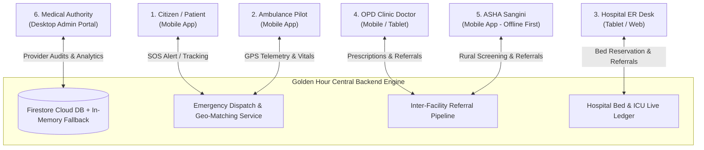
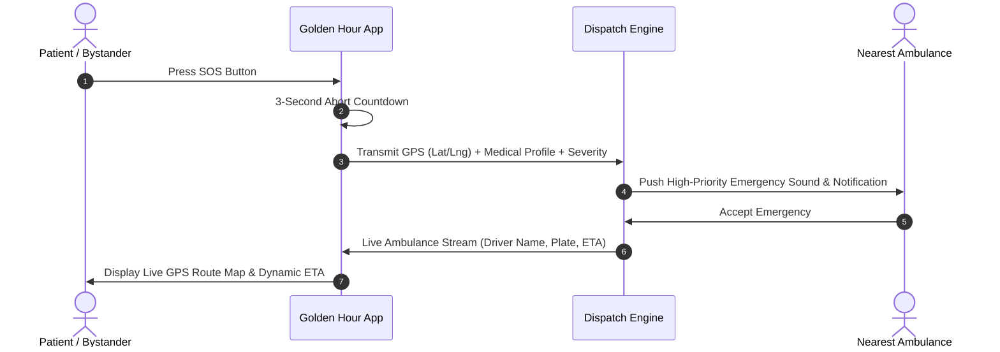
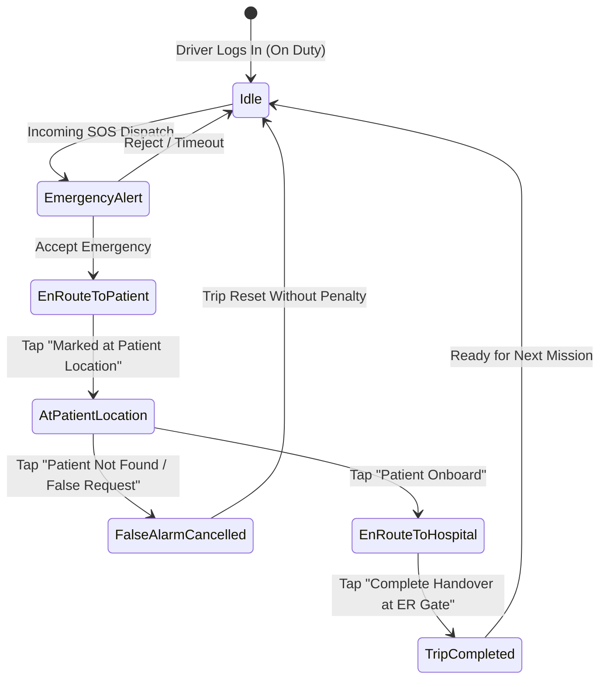
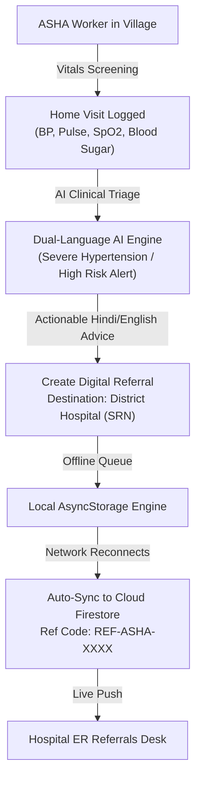

# 🚑 Golden Hour (Project 911) — Complete End-to-End User Manual

> **Golden Hour** is an AI-powered, mission-critical Emergency Medical Response & Healthcare Interoperability platform. Designed around the crucial first 60 minutes after trauma or acute onset, Golden Hour seamlessly coordinates Citizens/Patients, Ambulance Pilots, Hospital Emergency Rooms, OPD Doctors, and Rural ASHA Sanginis in real time.

---

## 📑 Table of Contents
1. [Architecture Overview & Role Matrix](#1-architecture-overview--role-matrix)
2. [Getting Started & Quick Demo Access](#2-getting-started--quick-demo-access)
3. [Language Selector & Global Role Switching](#3-language-selector--global-role-switching)
4. [Role 1: Citizen / Patient Emergency Portal](#4-role-1-citizen--patient-emergency-portal)
   - 4.1 [One-Tap SOS & Intelligent Safety Countdown](#41-one-tap-sos--intelligent-safety-countdown)
   - 4.2 [Voice AI SOS with Smart Clinical Verification](#42-voice-ai-sos-with-smart-clinical-verification)
   - 4.3 [False Alarm Cancellation Flow](#43-false-alarm-cancellation-flow)
   - 4.4 [Live Ambulance Telemetry & Route Map](#44-live-ambulance-telemetry--route-map)
   - 4.5 [Doctor Appointment Accordion / History Dropdown](#45-doctor-appointment-accordion--history-dropdown)
   - 4.6 [Emergency Medical Profile & ICE Contacts](#46-emergency-medical-profile--ice-contacts)
5. [Role 2: Ambulance Pilot / Driver Console](#5-role-2-ambulance-pilot--driver-console)
   - 5.1 [Login & Duty State Management](#51-login--duty-state-management)
   - 5.2 [Incoming Emergency Dispatch Acceptance](#52-incoming-emergency-dispatch-acceptance)
   - 5.3 [On-Site Arrival: "Marked at Patient Location"](#53-on-site-arrival-marked-at-patient-location)
   - 5.4 [False Request / "Patient Not Found" Handling](#54-false-request--patient-not-found-handling)
   - 5.5 [Patient Onboard, Live Vitals & ER Handover](#55-patient-onboard-live-vitals--er-handover)
6. [Role 3: Hospital ER Command Center](#6-role-3-hospital-er-command-center)
   - 6.1 [Dashboard & Real-Time Capacity Monitoring](#61-dashboard--real-time-capacity-monitoring)
   - 6.2 [Live Bed, ICU & Oxygen Capacity Controls](#62-live-bed-icu--oxygen-capacity-controls)
   - 6.3 [Incoming Ambulance Triage & Bed Reservation](#63-incoming-ambulance-triage--bed-reservation)
   - 6.4 [Doctor & ASHA Referrals Hub (with Unread Bell Badge)](#64-doctor--asha-referrals-hub-with-unread-bell-badge)
   - 6.5 [Referral Admission & Bed Freeing on Discharge](#65-referral-admission--bed-freeing-on-discharge)
7. [Role 4: Doctor OPD Clinic & Teleconsultation](#7-role-4-doctor-opd-clinic--teleconsultation)
   - 7.1 [Digital OPD Queue & Token Serving](#71-digital-opd-queue--token-serving)
   - 7.2 [Clinical Consultation, Vitals & Prescriptions](#72-clinical-consultation-vitals--prescriptions)
   - 7.3 [Hospital Referral with Severity & Facility Selection](#73-hospital-referral-with-severity--facility-selection)
   - 7.4 [Live WebRTC / Audio-Visual Teleconsultation](#74-live-webrtc--audio-visual-teleconsultation)
8. [Role 5: ASHA Sangini / Rural Frontline Health Worker](#8-role-5-asha-sangini--rural-frontline-health-worker)
   - 8.1 [Community Patient Registry & Search](#81-community-patient-registry--search)
   - 8.2 [Home Visit Logging & Vitals Screening](#82-home-visit-logging--vitals-screening)
   - 8.3 [Dual-Language AI Clinical Guidance (Hindi & English)](#83-dual-language-ai-clinical-guidance-hindi--english)
   - 8.4 [Digital Referral to PHC / District Hospital](#84-digital-referral-to-phc--district-hospital)
   - 8.5 [Offline-First Sync Engine](#85-offline-first-sync-engine)
9. [Role 6: Medical Administrator & Authority Dashboard](#9-role-6-medical-administrator--authority-dashboard)
10. [Troubleshooting & Evaluation Verification Guide](#10-troubleshooting--evaluation-verification-guide)

---

## 1. Architecture Overview & Role Matrix



---

## 2. Getting Started & Quick Demo Access

### 2.1 Launching the Application
Run the Expo development bundler from the project root:
```bash
npx expo start -c
```
Scan the QR code with **Expo Go** on Android/iOS, or install the compiled standalone Android APK.

### 2.2 Instant Demo Bypasses (No Registration Required)
For jury reviews, hackathons, and rapid evaluation, every login screen is equipped with a dedicated **Quick Demo Button**:

| Role | Screen Route | Demo Button Label | Pre-configured Identity |
| :--- | :--- | :--- | :--- |
| **Patient** | `/login` | `Explore as Demo Patient` | Rahul Sharma (`+91 98765 43210`) |
| **Ambulance** | `/driver-login` | `Quick Demo Pilot` | Rajesh Kumar (Ambulance `UP-70-EMG-108`) |
| **Hospital** | `/hospital-login` | `Quick Demo Hospital` | Apollo Multi-Specialty Hospital / SRN Trauma Center |
| **Doctor** | `/doctor-login` | `Quick Demo Doctor` | Dr. Priya Sharma, MD (Civil Lines OPD Clinic) |
| **ASHA Worker** | `/asha-login` | `Quick Demo ASHA` | Sunita Verma (ASHA Sangini, Prayagraj Rural) |
| **Admin** | `/admin-dashboard` | Direct role select | Chief Medical Officer (CMO Console) |

---

## 3. Language Selector & Global Role Switching

### 🌐 Trilingual Support
- **Top-Right Language Toggle:** Available across all screens.
- **Languages:** **English**, **हिंदी (Hindi)**, and **मराठी (Marathi)**.
- Switching language instantly translates buttons, badges, medical advice, and notification banners.

### 🔄 One-Tap Role Switching
- Every dashboard features a **‹ Back / Switch Role** button at the top-left corner.
- Tapping it opens an action sheet allowing you to log out or jump immediately to another role without re-entering credentials.

---

## 4. Role 1: Citizen / Patient Emergency Portal



### 4.1 One-Tap SOS & Intelligent Safety Countdown
1. **Trigger:** Tap the pulsating red **"SOS EMERGENCY"** button on the home screen.
2. **Safety Countdown:** A 3-second safety window gives you time to cancel accidental touches.
3. **Automated Dispatch:** Once 0 is reached, the system packages your precise GPS coordinates, pre-existing conditions, allergies, and blood group, dispatching to the closest active ambulance and trauma hospital.

### 4.2 Voice AI SOS with Smart Clinical Verification
- Tap the **Voice SOS Microphone** or enter symptoms via speech-to-text (e.g., *"Severe crushing chest pain and breathlessness"*).
- **Clinical Verification:** Casual queries (e.g., *"What is paracetamol?"*) are handled without triggering emergency alarms. Genuine medical crises (accidents, heart attacks, stroke symptoms) immediately activate ambulance dispatch.

### 4.3 False Alarm Cancellation Flow
- If triggered inadvertently:
  1. Tap **"Cancel Emergency (False Alarm)"**.
  2. Select an option (*Accidental Press*, *Resolved Independently*, *Testing*).
  3. The dispatched ambulance is instantly notified, preventing wasted emergency resources.

### 4.4 Live Ambulance Telemetry & Route Map
- Once accepted:
  - **Live GPS Map:** Shows the ambulance vehicle approaching your location in real time.
  - **Dynamic ETA:** Recalculated dynamically as the ambulance navigates city traffic.
  - **Driver Identity:** Displays driver name, phone number, and vehicle registration.

### 4.5 Doctor Appointment Accordion / History Dropdown
- Located on the Patient Home Dashboard.
- **Upcoming Appointments:** Displayed at the top with queue token numbers.
- **Past Clinical Encounters:** Collapsed in a clean **Dropdown/Accordion** to prevent clutter. Tapping expands past consultations, diagnoses, and digital prescriptions.

### 4.6 Emergency Medical Profile & ICE Contacts
- **Medical Setup (`/medical-setup`):** Stores Blood Type, Chronic Conditions (Hypertension, Diabetes, Asthma), Allergies, and Current Medications.
- **ICE Contacts (`/contacts-setup`):** Configures primary family emergency contacts who receive automatic SOS SMS notifications with your live GPS location.

---

## 5. Role 2: Ambulance Pilot / Driver Console



### 5.1 Login & Duty State Management
1. Open **Driver Login** ➔ Tap **"Quick Demo Pilot"**.
2. Toggle the **"ON DUTY"** switch at the top. When green, the vehicle is discoverable by the dispatch engine.

### 5.2 Incoming Emergency Dispatch Acceptance
- When an emergency matches your proximity:
  - An audible alert sounds with an Emergency Dispatch Card.
  - Card displays: Patient Name, Incident Nature (Cardiac, Trauma, Burn), Distance, and ETA.
  - Tap **"Accept Emergency"**.

### 5.3 On-Site Arrival: "Marked at Patient Location"
- Follow GPS turn-by-turn navigation.
- Upon pulling up to the scene, tap **"Marked at Patient Location"**.
- This updates both the patient and receiving hospital dashboards that paramedics have arrived on site.

### 5.4 False Request / "Patient Not Found" Handling
- If the patient is missing or the call was fraudulent:
  1. Tap **"Patient Not Found / False Request"**.
  2. Confirm the reason in the prompt.
  3. The trip terminates with status `FALSE_ALARM`, and the ambulance returns to active standby immediately.

### 5.5 Patient Onboard, Live Vitals & ER Handover
1. Once stabilized inside the ambulance, tap **"Patient Onboard ➔ En Route to Hospital"**.
2. Stream vitals (BP, SpO2, Pulse) directly to the receiving trauma center.
3. At the ER bay, tap **"Complete Handover & Trip"**. The ER desk receives clinical custody of the patient.

---

## 6. Role 3: Hospital ER Command Center

```mermaid
flowchart LR
    A["Doctor or ASHA Worker\nSubmits Referral"] -->|Instant WebSocket / DB Push| B["Hospital Header\nBell Icon Badge: 1"]
    B -->|ER Desk Clicks Bell| C["'Doctor / Community Referrals' Tab\n(Badge Cleared to 0)"]
    C -->|Review Details & Vitals| D["Click 'Accept & Reserve Bed'\n(1 Bed Reserved)"]
    D -->|Patient Transferred to ER| E["Click 'Patient Arrived / Admit'\n(Status: ADMITTED)"]
    E -->|Treatment Concluded| F["Click 'Discharge & Free Bed'\n(1 Bed Released to Ledger)"]
```



### 6.1 Dashboard & Real-Time Capacity Monitoring
- Displays live statistics:
  - **Active Emergency Arrivals**
  - **Total Bed Count & Available General Beds**
  - **ICU & Ventilator Availability**
  - **In-Transit Ambulance Telemetry**

### 6.2 Live Bed, ICU & Oxygen Capacity Controls
- Navigate to the **Capacity** tab.
- Easily increment or decrement available beds:
  - `Total Beds` (e.g., 50)
  - `Available General Beds` (e.g., 18)
  - `ICU Beds` (e.g., 12 total, 4 available)
- Any update syncs instantly across the city network so drivers and doctors refer patients only to facilities with open beds.

### 6.3 Incoming Ambulance Triage & Bed Reservation
- When an ambulance selects this hospital:
  - The ER console chimes with patient details and telemetry.
  - Pre-triage allows doctors to prepare trauma bays before the vehicle arrives.
  - Tap **"Reserve Bed"** to guarantee bed availability upon arrival.

### 6.4 Doctor & ASHA Referrals Hub (with Unread Bell Badge)
- Top Navigation: **[Emergencies]** vs **[Doctor / Community Referrals]**.
- **Unread Notification Bell:**
  - Whenever a Doctor or rural ASHA worker sends a referral, the header bell icon displays a red **"1"** badge.
  - Tapping the bell opens the referrals tab and clears the badge.
- **Referral Cards:**
  - Shows Patient Name, Referring Provider (*"Dr. Priya Sharma"* or *"Sunita Verma (ASHA Sangini)"*), Priority Badge (*CRITICAL / HIGH / NORMAL*), Patient Vitals snapshot, and clinical notes.
  - Deduplication cleanly keeps Doctor and ASHA referrals separated so neither overwrites the other.

### 6.5 Referral Admission & Bed Freeing on Discharge
1. **Accept:** Tap **"Accept & Reserve Bed"** ➔ 1 hospital bed is reserved.
2. **Admit:** When the patient arrives, tap **"Patient Arrived / Admit"** ➔ Status moves to `COMPLETED / ADMITTED`.
3. **Discharge:** Once treatment or surgery concludes, tap **"Discharge & Free Bed"**.
   - Confirmation prompt verifies release.
   - The reserved bed is released back into the hospital's live bed inventory.

---

## 7. Role 4: Doctor OPD Clinic & Teleconsultation

### 7.1 Digital OPD Queue & Token Serving
1. Open **Doctor Login** ➔ Tap **"Quick Demo Doctor"**.
2. Go to **Queue (`/queue`)**:
   - Lists today's queued patients by token (Token #1, #2, #3...).
   - Tap **"Call Next Patient"** to advance the queue and start consultation.

### 7.2 Clinical Consultation, Vitals & Prescriptions
- The consultation modal enables quick documentation:
  - **Diagnosis:** Select from standard conditions (e.g., *Acute Angina*, *Typhoid*, *Fracture*) or type custom.
  - **Vitals:** Blood Pressure, Pulse, SpO2, Temperature.
  - **Rx Medications:** Pick from pre-indexed medicines with dosage, frequency (`1-0-1`), and duration.

### 7.3 Hospital Referral with Severity & Facility Selection
- If the patient requires emergency hospitalization or tertiary care:
  1. Toggle **"Refer Patient to Hospital"** to ON.
  2. Select the destination facility (e.g., *Swaroop Rani Nehru Hospital* or *Apollo Multi-Specialty*).
  3. Select Priority: **HIGH** (Immediate / Red) or **NORMAL** (Scheduled / Amber).
  4. Enter Reason (e.g., *"Urgent ICU bed & emergency cardiac catheterization required"*).
  5. Tap **"Complete Consultation"**.
  - The digital referral is transmitted instantly to the receiving hospital ER console.

### 7.4 Live WebRTC / Audio-Visual Teleconsultation
- Access remote appointments with rural or home-quarantined patients through HD audio/video consultation with integrated in-call chat.

---

## 8. Role 5: ASHA Sangini / Rural Frontline Health Worker



### 8.1 Community Patient Registry & Search
- Open **ASHA Login** ➔ Tap **"Quick Demo ASHA"**.
- View high-risk rural profiles: pregnant women, elderly patients with hypertension, and infants.
- Search instantly by name or patient ID.

### 8.2 Home Visit Logging & Vitals Screening
- Tap **"Log Home Visit"**.
- Record point-of-care diagnostics:
  - Blood Pressure (e.g., `150/100 mmHg`)
  - Pulse (`92 bpm`)
  - Oxygen SpO2 (`95%`)
  - Random Blood Sugar (`180 mg/dL`)
  - Symptoms Description (e.g., *"Severe headache, chest heaviness"*).

### 8.3 Dual-Language AI Clinical Guidance (Hindi & English)
- The system automatically evaluates vitals and provides clear, actionable clinical advice in **Hindi**:
  - *Risk Level: उच्च जोखिम (HIGH)*
  - *Clinical Guidance: मरीज को तुरंत नजदीकी प्राथमिक स्वास्थ्य केंद्र (PHC) या जिला अस्पताल रेफर करें। पर्याप्त आराम दें और पानी पिलाएं।*

### 8.4 Digital Referral to PHC / District Hospital
1. Tap **"Create Referral"** (`/referral`).
2. Select Patient and destination facility (e.g., *Swaroop Rani Nehru Hospital (District Trauma)*).
3. Select Priority: **CRITICAL / HIGH / NORMAL**.
4. Enter referral reason.
5. Tap **"Submit Digital Referral"**.
   - A unique code (e.g., `REF-ASHA-ABC123`) is generated.
   - The referral immediately appears in the hospital console's referral queue.

### 8.5 Offline-First Sync Engine
- Works seamlessly in rural areas with zero internet connectivity.
- Referrals and visits are persisted in encrypted local storage.
- An automatic background synchronization worker triggers the moment mobile data or Wi-Fi reconnects.

---

## 9. Role 6: Medical Administrator & Authority Dashboard

- Access route: `/admin-dashboard`.
- **Core Governance Tools:**
  - **Provider Verification:** Review and approve/reject newly submitted hospital licenses, doctor registrations, and ambulance permits.
  - **Citywide Telemetry:** Real-time heatmaps of emergency hotspots and average response times across Prayagraj.
  - **Audit Logs:** Immutable timestamped trail of dispatches, hospital admissions, and bed reservations.

---

## 10. Troubleshooting & Evaluation Verification Guide

| Scenario | Root Cause | Solution |
| :--- | :--- | :--- |
| **Referral not visible on hospital desk** | Hospital was viewing wrong tab or stale cache | Ensure you are on the **"Doctor / Community Referrals"** tab. Pull down from top to refresh the list. |
| **Unread Bell Badge stays at 1** | Referrals screen not opened yet | Tap directly on the Bell Icon in the header; it immediately opens the referrals queue and clears the badge to 0. |
| **Location permission prompt appears** | GPS disabled on test device | Allow "Precise Location While In Use" in device settings to enable live ambulance routing. |
| **Quick evaluation across multiple roles** | Switching roles without logging out | Tap the **‹ Back / Switch Role** button at the top-left of any dashboard to instantly select another role. |
| **Testing with no active internet** | Simulating remote village | Use ASHA or Driver mode freely; all operations queue in offline storage and sync automatically when internet returns. |

---

### 🌟 Project Summary
**Golden Hour** bridges the critical gap between distress calls and hospital doors. Through coordinated AI triage, live hospital bed synchronization, driver false-alarm protection, and rural ASHA connectivity, the platform ensures that no life is lost due to delays during the golden hour.
